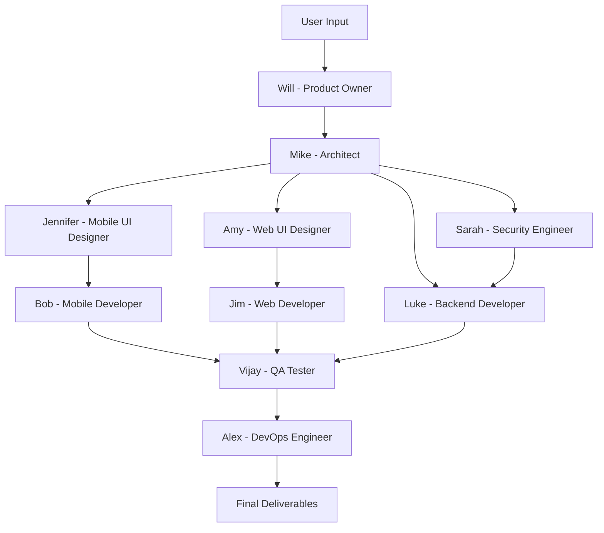

# AI Agent Team - Complete Development Lifecycle Automation

🚀 **An intelligent multi-agent system that automates the entire software development lifecycle from requirements gathering to production deployment.**

## Overview

The AI Agent Team is a coordinated system of 10 specialized AI agents that work together to deliver complete software projects. Each agent has expertise in a specific domain and produces structured deliverables that feed into subsequent development phases.

### 🎯 Key Features

- **Complete SDLC Coverage**: From product requirements to production deployment
- **10 Specialized Agents**: Each with unique expertise and responsibilities  
- **Structured Workflow**: Waterfall-inspired process with clear dependencies
- **Production-Ready Output**: Full documentation, code plans, and deployment strategies
- **Security-First Approach**: Integrated security throughout the development process
- **Multi-Platform Support**: Mobile (Flutter), Web (Next.js), and Backend (FastAPI)

## 🏗️ Architecture



## 👥 Meet the Team

| Agent | Name | Role | Expertise |
|-------|------|------|-----------|
| 🎯 | **Will** | Product Owner | Requirements gathering, user stories, acceptance criteria |
| 🏗️ | **Mike** | System Architect | Technical architecture, API design, scalability planning |
| 🎨 | **Jennifer** | Mobile UI Designer | Mobile-first design, user journeys, accessibility |
| 🎨 | **Amy** | Web UI Designer | Modern web design, responsive layouts, design systems |
| 📱 | **Bob** | Mobile Developer | Flutter development, cross-platform mobile apps |
| 💻 | **Jim** | Web Developer | Next.js, React, TypeScript, modern web development |
| ⚙️ | **Luke** | Backend Developer | FastAPI, Python, database design, API development |
| 🔒 | **Sarah** | Security Engineer | Security architecture, threat modeling, compliance |
| 🧪 | **Vijay** | QA Tester | Test automation, quality assurance, performance testing |
| 🚀 | **Alex** | DevOps Engineer | CI/CD, infrastructure, deployment, monitoring |

## 🚀 Getting Started

### Prerequisites

- Claude Code CLI installed and configured
- Access to the AI Agent Team repository
- Basic understanding of software development concepts

### Quick Start

1. **Clone the Repository**
   ```bash
   git clone <repository-url>
   cd ai-agent-team
   ```

2. **Review the Architecture**
   ```bash
   # View the visual architecture
   open AI-Agent-Team.drawio.svg
   
   # Read the complete PRD
   cat prd.md
   ```

3. **Start with Requirements Gathering**
   ```bash
   # Invoke Will (Product Owner) to gather requirements
   claude-code --agent po
   ```

4. **Follow the Workflow**
   Each agent builds on the previous agent's output:
   - Will → Mike → Jennifer/Amy/Sarah → Bob/Jim/Luke → Vijay → Alex

### Usage Examples

#### Example 1: E-commerce Platform

```bash
# 1. Gather requirements with Will
claude-code --agent po
# User describes: "I need an e-commerce platform with mobile app and admin dashboard"

# 2. Design architecture with Mike
claude-code --agent architect
# Reviews PRD, designs system architecture

# 3. Design mobile UI with Jennifer
claude-code --agent mobile-ui-designer
# Creates mobile-first designs based on architecture

# 4. Continue through the workflow...
```

#### Example 2: SaaS Application

```bash
# Full workflow for a SaaS application
claude-code --agent po              # Requirements gathering
claude-code --agent architect       # System design
claude-code --agent security-engineer # Security architecture
claude-code --agent web-ui-designer # Web interface design
claude-code --agent web-developer   # Web development plan
claude-code --agent backend-developer # API development plan
claude-code --agent qa-tester       # Testing strategy
claude-code --agent devops-engineer # Deployment strategy
```

## 📁 Project Structure

```
ai-agent-team/
├── README.md                    # This file
├── CLAUDE.md                    # Agent configuration guide
├── prd.md                       # Product Requirements Document
├── AI-Agent-Team.drawio.svg     # Visual architecture diagram
├── docs/                        # Generated deliverables
│   ├── PRD.md                   # Product requirements (Will)
│   ├── DESIGN.md                # System architecture (Mike)
│   ├── MOBILE-UI.md             # Mobile UI specs (Jennifer)
│   ├── WEB-UI.md                # Web UI specs (Amy)
│   ├── MOBILE-DEV.md            # Mobile dev plan (Bob)
│   ├── WEB-DEV.md               # Web dev plan (Jim)
│   ├── BACKEND-DEV.md           # Backend dev plan (Luke)
│   ├── SECURITY.md              # Security architecture (Sarah)
│   ├── QA-TEST.md               # Testing strategy (Vijay)
│   └── DEVOPS.md                # Infrastructure plan (Alex)
└── .claude/agents/              # Agent definitions
    ├── po.md                    # Will - Product Owner
    ├── architect.md             # Mike - System Architect
    ├── mobile-ui-designer.md    # Jennifer - Mobile UI Designer
    ├── web-ui-designer.md       # Amy - Web UI Designer
    ├── mobile-developer.md      # Bob - Mobile Developer
    ├── web-developer.md         # Jim - Web Developer
    ├── backend-developer.md     # Luke - Backend Developer
    ├── security-engineer.md     # Sarah - Security Engineer
    ├── qa-tester.md             # Vijay - QA Tester
    └── devops-engineer.md       # Alex - DevOps Engineer
```

## 🛠️ Technology Stack

### Frontend
- **Mobile**: Flutter, Dart
- **Web**: Next.js, React, TypeScript, shadcn/ui, Tailwind CSS

### Backend
- **API**: Python, FastAPI
- **Database**: SQLite (POC), PostgreSQL (Production)
- **Cache**: Redis

### Infrastructure
- **Containerization**: Docker, Kubernetes
- **Cloud**: AWS/GCP/Azure
- **CI/CD**: GitHub Actions, GitLab CI, or Jenkins
- **Monitoring**: Prometheus, Grafana, ELK Stack

## 📊 Workflow Process

1. **Requirements** → Will gathers and documents user requirements
2. **Architecture** → Mike designs technical architecture and APIs
3. **Design** → Jennifer (mobile) and Amy (web) create UI/UX designs
4. **Security** → Sarah defines security architecture and requirements
5. **Development** → Bob (mobile), Jim (web), Luke (backend) create implementation plans
6. **Testing** → Vijay designs comprehensive testing strategy
7. **Deployment** → Alex creates infrastructure and deployment strategy

## 🔧 Customization

The AI Agent Team can be customized for different:

- **Technology Stacks**: Modify agent definitions for different frameworks
- **Team Sizes**: Add or remove agents based on project needs  
- **Methodologies**: Adapt workflow for Agile, DevOps, or other approaches
- **Industries**: Customize for healthcare, finance, education, etc.

See `CLAUDE.md` for detailed customization instructions.

## 🤝 Contributing

1. Fork the repository
2. Create a feature branch
3. Make your changes to agent definitions or documentation
4. Test with sample projects
5. Submit a pull request

## 📄 License

[MIT License](LICENSE) - Feel free to use and modify for your projects.

## 🆘 Support

- **Documentation**: See `CLAUDE.md` for detailed configuration
- **Issues**: Report bugs and feature requests via GitHub Issues
- **Community**: Join discussions in GitHub Discussions

---

**Built with ❤️ by the AI Agent Team**

*Automating software development, one agent at a time.*