# AI Agent Team - Complete Development Lifecycle Automation

🚀 **An intelligent multi-agent system that automates the entire software development lifecycle from requirements gathering to production deployment.**

## Overview

The AI Agent Team is a coordinated system of 10 specialized AI agents that work together to deliver complete software projects. Each agent has expertise in a specific domain and produces structured deliverables that feed into subsequent development phases.

## 🎯 **Usage Modes**

The AI Agent Team supports two distinct usage modes to fit your development workflow:

### **🗣️ Interactive Mode (Direct Claude Conversation)**
Use the framework directly in conversation with Claude - no CLI setup required.

**Benefits:**
- ✅ **Immediate feedback** and real-time clarification
- ✅ **Iterative refinement** of requirements and designs  
- ✅ **Natural conversation flow** with agents
- ✅ **No installation required** - works directly in Claude interface
- ✅ **Perfect for exploration** and initial project planning

**Usage:**
```
claude --agent [agent-name]
[DESIGN PHASE] Create expense management system requirements
```

### **💻 CLI Mode (Terminal Commands)**  
Use the framework from your terminal for automation and scripting.

**Benefits:**
- ✅ **Script automation** capabilities for repeatable workflows
- ✅ **Batch processing** of multiple agents
- ✅ **Integration** with development tools and CI/CD
- ✅ **Version control** integration
- ✅ **Perfect for production** workflows and team collaboration

**Usage:**
```bash
claude --design --agent po "Create expense management system"
claude --develop --agent backend-developer "Implement authentication"
```

### 🎯 Key Features

- **Complete SDLC Coverage**: From product requirements to production deployment
- **10 Specialized Agents**: Each with unique expertise and responsibilities  
- **Structured Workflow**: Waterfall-inspired process with clear dependencies
- **Production-Ready Output**: Full documentation, code plans, and deployment strategies
- **Security-First Approach**: Integrated security throughout the development process
- **Multi-Platform Support**: Mobile (Flutter), Web (Next.js), and Backend (FastAPI)

## 🏗️ Two-Phase Architecture

### **🏗️ DESIGN PHASE Workflow**
- 🎯 **Purpose:** Create comprehensive planning documents
- 🏗️ **Output:** Architecture specifications, implementation roadmaps  
- ✅ **Completion:** All design documents exist and are validated

```mermaid
graph TD
    A["`🎯 **User Input**
    Project Requirements`"] --> B["`🎯 **Will - Product Owner**
    Requirements Gathering
    📄 PRD.md`"]
    
    B --> C["`🏗️ **Mike - System Architect**
    Technical Architecture
    📄 DESIGN.md`"]
    
    C --> D["`🎨 **Jennifer - Mobile UI Designer**
    Mobile Interface Design
    📄 MOBILE-UI.md`"]
    
    C --> E["`🎨 **Amy - Web UI Designer**
    Web Dashboard Design
    📄 WEB-UI.md`"]
    
    C --> K["`🔒 **Sarah - Security Engineer**
    Security Architecture
    📄 SECURITY.md`"]
    
    D --> F["`📱 **Bob - Mobile Developer**
    Mobile Implementation Plan
    📄 MOBILE-DEV.md`"]
    
    E --> G["`💻 **Jim - Web Developer**
    Web Implementation Plan
    📄 WEB-DEV.md`"]
    
    C --> H["`⚙️ **Luke - Backend Developer**
    Backend Implementation Plan
    📄 BACKEND-DEV.md`"]
    
    K --> H
    
    F --> I["`🧪 **Vijay - QA Tester**
    Testing Strategy
    📄 QA-TESTING.md`"]
    
    G --> I
    H --> I
    
    I --> L["`🚀 **Alex - DevOps Engineer**
    Infrastructure Plan
    📄 DEVOPS-DEPLOY.md`"]
    
    L --> M["`📋 **Complete Design Documents**
    Ready for Implementation`"]
    
    style A fill:#e1f5fe
    style M fill:#e8f5e8
    style B fill:#fff3e0
    style C fill:#f3e5f5
    style D fill:#fce4ec
    style E fill:#fce4ec
    style K fill:#ffebee
    style F fill:#e3f2fd
    style G fill:#e3f2fd
    style H fill:#e3f2fd
    style I fill:#f1f8e9
    style L fill:#fff8e1
```


### **💻 IMPLEMENTATION PHASE Workflow**
- 💻 **Purpose:** Write actual production code following design specifications
- 🔧 **Output:** Working applications, tests, infrastructure
- ✅ **Completion:** Production-ready system is deployed


## 📋 **Agent Phase Reference**

**📄 See [AGENT-PHASE-MAPPING.md](AGENT-PHASE-MAPPING.md) for complete agent phase documentation**

### **🏗️ Design Phase Agents**
- **Design-Only (4):** Will, Mike, Jennifer, Amy - Create specifications only
- **Dual-Phase (6):** Sarah, Bob, Jim, Luke, Vijay, Alex - Plan AND implement

### **💻 Implementation Phase Agents**  
- **Implementation-Capable (6):** Sarah, Bob, Jim, Luke, Vijay, Alex - Write actual code

## 👥 Meet the Team

| Agent | Name | Role | Design Phase | Implementation Phase |
|-------|------|------|-------------|---------------------|
| 🎯 | **Will** | Product Owner | ✅ Requirements & Stories | ❌ N/A |
| 🏗️ | **Mike** | System Architect | ✅ System Architecture | ❌ N/A |
| 🎨 | **Jennifer** | Mobile UI Designer | ✅ Mobile UI Design | ❌ N/A |
| 🎨 | **Amy** | Web UI Designer | ✅ Web UI Design | ❌ N/A |
| 🔒 | **Sarah** | Security Engineer | ✅ Security Architecture | ✅ Security Validation |
| 📱 | **Bob** | Mobile Developer | ✅ Mobile Dev Planning | ✅ Flutter Implementation |
| 💻 | **Jim** | Web Developer | ✅ Web Dev Planning | ✅ Next.js Implementation |
| ⚙️ | **Luke** | Backend Developer | ✅ Backend Dev Planning | ✅ FastAPI Implementation |
| 🧪 | **Vijay** | QA Tester | ✅ Testing Strategy | ✅ Test Implementation |
| 🚀 | **Alex** | DevOps Engineer | ✅ Infrastructure Planning | ✅ DevOps Implementation |

## 🎯 ExpenseFlow Showcase - Complete Implementation

**✅ We've successfully demonstrated the entire AI Agent Team workflow by building ExpenseFlow**, a comprehensive expense management system. This showcase proves the framework's effectiveness in delivering enterprise-grade software solutions.

### 📋 What We Built Together

The 10 AI agents systematically collaborated to create:

**📄 Complete Documentation Suite:**
- `examples/expenseflow/design/PRD.md` - Product Requirements (443 lines, 40+ user stories)
- `examples/expenseflow/design/DESIGN.md` - System Architecture with microservices
- `examples/expenseflow/design/MOBILE-UI.md` - Mobile UI Design (65 pages with accessibility)
- `examples/expenseflow/design/WEB-UI.md` - Web Dashboard Design with data visualization
- `examples/expenseflow/design/SECURITY.md` - Enterprise Security Architecture with STRIDE analysis
- `examples/expenseflow/design/MOBILE-DEV.md` - Flutter Implementation Plan with BLoC pattern
- `examples/expenseflow/design/WEB-DEV.md` - Next.js Implementation with TypeScript
- `examples/expenseflow/design/BACKEND-DEV.md` - FastAPI Backend with PostgreSQL
- `examples/expenseflow/design/QA-TESTING.md` - Comprehensive Testing Strategy
- `examples/expenseflow/design/DEVOPS-DEPLOY.md` - DevOps & AWS Infrastructure Plan

**🏗️ Multi-Platform System Design:**
- **Mobile App**: Flutter with offline-first architecture, OCR receipt processing, biometric auth
- **Web Dashboard**: Next.js with real-time notifications, analytics, responsive design
- **Backend API**: FastAPI with PostgreSQL, background tasks, compliance features
- **Infrastructure**: AWS with Kubernetes, auto-scaling, comprehensive monitoring

**🔄 Key Insight: Design vs Implementation**

**What the AI Agent Team Delivered:**
- ✅ **Complete blueprints** - Detailed design documents from all 10 agents
- ✅ **Implementation roadmaps** - Step-by-step plans for building each component
- ✅ **Architecture specifications** - Technical designs ready for development
- ✅ **Enterprise-grade planning** - Security, compliance, testing, and deployment strategies

**What's Next - Actual Implementation:**
- 🚧 **Code development** - Writing the actual Flutter, Next.js, and FastAPI code
- 🚧 **Infrastructure deployment** - Creating AWS resources and CI/CD pipelines
- 🚧 **Integration testing** - Connecting all components together

**💡 The Value Delivered:**

The AI Agent Team eliminated the most time-consuming part of software development - the **planning and design phase**. Typically taking 3-6 months with traditional teams, we completed comprehensive planning for an enterprise application in a systematic workflow.

## 🚀 Getting Started

### Prerequisites

- Claude Code CLI installed and configured
- Access to the AI Agent Team repository
- Basic understanding of software development concepts

### Quick Start

1. **Clone the Repository**
   ```bash
   git clone <repository-url>
   cd ai-agent-team
   ```

2. **Review the ExpenseFlow Showcase**
   ```bash
   # View the ExpenseFlow example
   ls examples/expenseflow/design/
   
   # Read the complete ExpenseFlow PRD
   cat examples/expenseflow/design/PRD.md
   
   # Read the initial framework PRD
   cat INIT-PRD.md
   
   # Explore framework documentation
   ls framework/
   
   # Check out agent definitions
   ls .claude/agents/
   
   # Read the marketing article
   cat ARTICLE.md
   
   # See your active workspace
   ls design-phase/
   ls implementation/
   ```

3. **Study the AI Agent Workflow**
   Review how each agent built on the previous agent's work in the ExpenseFlow example:
   - Will → Mike → Jennifer/Amy/Sarah → Bob/Jim/Luke → Vijay → Alex
   
   ```bash
   # See the complete workflow progression in ExpenseFlow
   ls examples/expenseflow/design/
   
   # Study how agents referenced each other's work
   grep -l "PRD.md" examples/expenseflow/design/*.md
   grep -l "DESIGN.md" examples/expenseflow/design/*.md
   ```

4. **Start Your First Project**
   ```bash
   # METHOD 1: Using CLI flags (Recommended - Crystal Clear)
   claude --design --agent po "Create expense management system"
   claude --design --agent architect "Design scalable microservices architecture"
   claude --develop --agent backend-developer "Implement authentication endpoints"
   
   # METHOD 2: Using prompt patterns (Traditional)
   claude --agent po
   # Prompt: [DESIGN PHASE] Gather requirements for [your-project]
   
   claude --agent backend-developer  
   # Prompt: [DEVELOP PHASE] Implement authentication endpoints
   ```

### 🎯 **NEW: Crystal Clear Usage with CLI Flags & Dual Mode Support**

**🔥 MAJOR IMPROVEMENT:** No more confusion! Use explicit CLI flags or prompt patterns to indicate whether you're planning or coding.

#### **Design Phase Example: E-commerce Platform**

**METHOD 1: CLI Flags (Recommended)**
```bash
# Crystal clear commands - no ambiguity!
claude --design --agent po "E-commerce platform with mobile app and admin dashboard"
claude --design --agent architect "Scalable system architecture for e-commerce platform"
claude --design --agent security-engineer "Security architecture with payment processing compliance"
claude --design --agent mobile-ui-designer "Mobile shopping experience and product catalog"
claude --design --agent web-ui-designer "Admin dashboard for inventory and order management"
claude --design --agent backend-developer "Backend API with product catalog and payments"
claude --design --agent web-developer "Next.js admin dashboard architecture"
claude --design --agent mobile-developer "Flutter shopping app with offline cart"

# Result: Complete set of design documents ready for implementation
```

**METHOD 2: Prompt Patterns (Traditional)**
```bash
# Traditional method with prompt keywords
claude --agent po "[DESIGN PHASE] E-commerce platform requirements"
claude --agent architect "[DESIGN PHASE] System architecture design"
# ... continue with [DESIGN PHASE] prefix for each agent
```

#### **Implementation Phase Example: Building the E-commerce Platform**

**METHOD 1: CLI Flags (Recommended)**
```bash
# Crystal clear implementation commands
claude --develop --agent backend-developer "User authentication and registration APIs"
claude --develop --agent backend-developer "Product catalog API with search and filtering"
claude --develop --agent backend-developer "Shopping cart and checkout API with payments"

# Frontend Implementation
claude --develop --agent web-developer "Admin dashboard layout with sidebar navigation"
claude --develop --agent web-developer "Product management interface with image upload"

# Mobile Implementation  
claude --develop --agent mobile-developer "Product catalog screen with search"
claude --develop --agent mobile-developer "Shopping cart screen with offline sync"

# Testing Implementation
claude --develop --agent qa-tester "Comprehensive API tests for e-commerce endpoints"

# Result: Working e-commerce application with mobile app and admin dashboard
```

**METHOD 2: Prompt Patterns (Traditional)**
```bash
# Traditional method with prompt keywords
claude --agent backend-developer "[DEVELOP PHASE] Implement authentication APIs"
claude --agent web-developer "[DEVELOP PHASE] Create admin dashboard layout"
# ... continue with [DEVELOP PHASE] prefix for each agent
```

#### **Quick Start Example: Simple SaaS Application**

```bash
# DESIGN PHASE - Crystal clear planning (CLI Flags)
claude --design --agent po "Project management SaaS requirements"
claude --design --agent architect "System architecture with multi-tenancy"
claude --design --agent security-engineer "Security framework with RBAC"
claude --design --agent web-developer "Next.js application architecture"
claude --design --agent backend-developer "FastAPI backend with PostgreSQL"

# DEVELOP PHASE - Crystal clear implementation (CLI Flags)
claude --develop --agent backend-developer "User authentication system"
claude --develop --agent web-developer "Project dashboard component"
claude --develop --agent qa-tester "Testing suite for authentication"

# Alternative: Traditional prompt method still works
# claude --agent po "[DESIGN PHASE] SaaS requirements"
# claude --agent backend-developer "[DEVELOP PHASE] Implement auth"
```

## 📁 Project Structure

```
ai-agent-team/
├── README.md                    # This file
├── INIT-PRD.md                  # Initial Product Requirements Document
├── ARTICLE.md                   # Marketing article
├── AI-Agent-Team.drawio.svg     # Visual architecture diagram
├── framework/                   # 🆕 Framework documentation
│   ├── README.md                # Framework overview
│   ├── CLAUDE.md                # Configuration guide
│   ├── IMPLEMENTATION.md        # Implementation guide
│   ├── PROMPT-PATTERNS.md       # Prompt patterns guide
│   └── FRAMEWORK-IMPROVEMENTS.md # Latest improvements
├── design-phase/                # 🆕 DESIGN PHASE workspace (your active project)
│   └── README.md                # Design phase workspace guide
├── implementation/              # 🆕 DEVELOP PHASE workspace (your active project)
│   ├── README.md                # Implementation guide
│   ├── backend/                 # Backend code workspace
│   ├── frontend-web/            # Web frontend workspace
│   ├── mobile-app/              # Mobile app workspace
│   └── infrastructure/          # Infrastructure code workspace
├── examples/                    # 🆕 Framework showcases and examples
│   ├── README.md                # Examples overview
│   └── expenseflow/             # Complete ExpenseFlow showcase
│       ├── README.md            # ExpenseFlow showcase overview
│       ├── design/              # Complete DESIGN PHASE output
│       │   ├── PRD.md           # Product requirements (Will)
│       │   ├── DESIGN.md        # System architecture (Mike)
│       │   ├── MOBILE-UI.md     # Mobile UI specs (Jennifer)
│       │   ├── WEB-UI.md        # Web UI specs (Amy)
│       │   ├── SECURITY.md      # Security architecture (Sarah)
│       │   ├── MOBILE-DEV.md    # Mobile dev plan (Bob)
│       │   ├── WEB-DEV.md       # Web dev plan (Jim)
│       │   ├── BACKEND-DEV.md   # Backend dev plan (Luke)
│       │   ├── QA-TESTING.md    # Testing strategy (Vijay)
│       │   └── DEVOPS-DEPLOY.md # Infrastructure plan (Alex)
│       └── implementation/      # ExpenseFlow implementation workspace
├── scripts/                     # Helper scripts for enhanced UX
│   ├── README.md                # Scripts documentation
│   ├── design.sh                # Design phase helper script
│   └── develop.sh               # Develop phase helper script
└── .claude/agents/              # Enhanced agent definitions
    ├── po.md                    # Will - Product Owner
    ├── architect.md             # Mike - System Architect
    ├── mobile-ui-designer.md    # Jennifer - Mobile UI Designer
    ├── web-ui-designer.md       # Amy - Web UI Designer
    ├── mobile-developer.md      # Bob - Mobile Developer (🆕 Enhanced)
    ├── web-developer.md         # Jim - Web Developer (🆕 Enhanced)
    ├── backend-developer.md     # Luke - Backend Developer (🆕 Enhanced)
    ├── security-engineer.md     # Sarah - Security Engineer
    ├── qa-tester.md             # Vijay - QA Tester
    └── devops-engineer.md       # Alex - DevOps Engineer
```

## 🛠️ Technology Stack

### Frontend
- **Mobile**: Flutter, Dart
- **Web**: Next.js, React, TypeScript, shadcn/ui, Tailwind CSS

### Backend
- **API**: Python, FastAPI
- **Database**: SQLite (POC), PostgreSQL (Production)
- **Cache**: Redis

### Infrastructure
- **Containerization**: Docker, Kubernetes
- **Cloud**: AWS/GCP/Azure
- **CI/CD**: GitHub Actions, GitLab CI, or Jenkins
- **Monitoring**: Prometheus, Grafana, ELK Stack

## 🎯 **Framework Improvements**

### **🔥 NEW: Crystal Clear Design vs Develop Modes**

**Major UX Enhancement:** We've eliminated confusion by implementing explicit modes:

**🏗️ DESIGN PHASE:**
- Creates comprehensive planning documents
- Generates system architecture and specifications
- Focuses on planning, not coding
- Uses `[DESIGN PHASE]` prompt pattern

**💻 DEVELOP PHASE:**
- Implements actual working code
- Follows design specifications automatically
- Focuses on coding, not planning  
- Uses `[DEVELOP PHASE]` prompt pattern

### **🚀 Enhanced Helper Scripts**

**Better User Experience:**
```bash
# Crystal clear design commands
./scripts/design.sh backend-developer "Plan expense management API"

# Crystal clear implementation commands  
./scripts/develop.sh backend-developer "Implement authentication endpoints"
```

### **🧠 Intelligent Agent Behavior**

**Each agent now automatically:**
- 🎯 Detects phase from prompt patterns
- 📚 References appropriate design documents
- 🔄 Follows phase-specific workflows
- ✅ Self-validates against specifications

## 📁 **Improved Project Organization**

**🔥 NEW: Crystal Clear Folder Structure**

We've reorganized the project to perfectly align with the two-phase approach:

### **📋 Framework Documentation**
- `framework/` - All framework documentation and guides
- `framework/CLAUDE.md` - Configuration and customization guide
- `framework/IMPLEMENTATION.md` - Step-by-step implementation guide

### **📁 Active Project Workspaces**
- `design-phase/` - Your DESIGN PHASE workspace for creating specifications
- `implementation/` - Your DEVELOP PHASE workspace for writing code

### **📚 Framework Examples**
- `examples/expenseflow/` - Complete ExpenseFlow showcase demonstrating full workflow
- `examples/expenseflow/design/PRD.md` - 443-line product requirements document
- `examples/expenseflow/design/BACKEND-DEV.md` - Comprehensive backend implementation plan

### **🚀 Enhanced User Experience**
- `scripts/` - Helper scripts for crystal-clear phase selection
- Clear separation between framework, design, and implementation
- Each folder has comprehensive README with guidance

## 📊 Workflow Process

1. **Requirements** → Will gathers and documents user requirements
2. **Architecture** → Mike designs technical architecture and APIs
3. **Design** → Jennifer (mobile) and Amy (web) create UI/UX designs
4. **Security** → Sarah defines security architecture and requirements
5. **Development** → Bob (mobile), Jim (web), Luke (backend) create implementation plans
6. **Testing** → Vijay designs comprehensive testing strategy
7. **Deployment** → Alex creates infrastructure and deployment strategy

## 🔧 Customization

The AI Agent Team can be customized for different:

- **Technology Stacks**: Modify agent definitions for different frameworks
- **Team Sizes**: Add or remove agents based on project needs  
- **Methodologies**: Adapt workflow for Agile, DevOps, or other approaches
- **Industries**: Customize for healthcare, finance, education, etc.

See `framework/CLAUDE.md` for detailed configuration and customization instructions.

## 🤝 Contributing

1. Fork the repository
2. Create a feature branch
3. Make your changes to agent definitions or documentation
4. Test with sample projects
5. Submit a pull request

## 📄 License

[MIT License](LICENSE) - Feel free to use and modify for your projects.

## 🆘 Support

- **Documentation**: See `framework/CLAUDE.md` for detailed configuration
- **Issues**: Report bugs and feature requests via GitHub Issues
- **Community**: Join discussions in GitHub Discussions

---

**Built with ❤️ by the AI Agent Team**

*Automating software development, one agent at a time.*