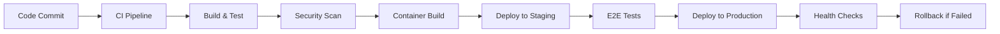

# ExpenseFlow DevOps & Deployment Strategy

**DevOps Engineer:** Alex  
**Date:** August 1, 2025  
**Version:** 1.0

---

## Executive Summary

This document outlines the comprehensive DevOps and deployment strategy for ExpenseFlow, a multi-platform expense management system. The strategy ensures scalable, secure, and reliable infrastructure while maintaining operational excellence through automation, monitoring, and best practices.

### Infrastructure Objectives
- **Scalability**: Auto-scaling infrastructure supporting 10K+ concurrent users
- **Reliability**: 99.9% uptime with <1 hour MTTR for incidents
- **Security**: Zero-trust architecture with automated security scanning
- **Cost Efficiency**: Optimized resource utilization with 30% cost savings through automation
- **Compliance**: SOX, GDPR, and security compliance through Infrastructure as Code

---

## Infrastructure Architecture

### Cloud Platform Strategy
**Primary Platform: AWS**
- Global presence with 99.99% SLA
- Comprehensive security and compliance certifications
- Mature container and serverless offerings
- Cost-effective scaling capabilities

### Multi-Region Architecture
```yaml
regions:
  primary:
    region: us-east-1
    availability_zones: [us-east-1a, us-east-1b, us-east-1c]
    services:
      - application_workloads
      - primary_database
      - redis_cache
      - file_storage
  
  secondary:
    region: us-west-2
    availability_zones: [us-west-2a, us-west-2b]
    services:
      - disaster_recovery
      - read_replicas
      - backup_storage
      - monitoring_aggregation
```

### Infrastructure Components

#### Compute Infrastructure
```yaml
compute_services:
  kubernetes_cluster:
    service: Amazon EKS
    version: 1.28
    node_groups:
      - name: system-nodes
        instance_type: t3.medium
        min_size: 2
        max_size: 5
        desired_size: 3
      - name: app-nodes
        instance_type: c5.large
        min_size: 3
        max_size: 20
        desired_size: 5
      - name: gpu-nodes
        instance_type: p3.2xlarge
        min_size: 0
        max_size: 3
        desired_size: 1
  
  serverless_functions:
    service: AWS Lambda
    runtime: python3.11
    functions:
      - ocr_processing
      - image_optimization
      - notification_sender
      - report_generator
```

#### Database Infrastructure
```yaml
database_services:
  primary_database:
    service: Amazon RDS PostgreSQL
    version: 15.4
    instance_class: db.r6g.xlarge
    storage: 1TB
    backup_retention: 30_days
    multi_az: true
  
  read_replicas:
    service: Amazon RDS PostgreSQL
    instance_class: db.r6g.large
    regions: [us-east-1, us-west-2]
    count: 2
  
  cache_layer:
    service: Amazon ElastiCache Redis
    version: 7.0
    node_type: cache.r6g.large
    num_cache_nodes: 3
    cluster_mode: enabled
  
  time_series_db:
    service: Amazon Timestream
    use_case: metrics_and_monitoring
    retention: 90_days
```

#### Storage Infrastructure
```yaml
storage_services:
  object_storage:
    service: Amazon S3
    buckets:
      - receipts-prod
      - backups-prod
      - static-assets-prod
      - logs-archive-prod
    encryption: AES-256
    versioning: enabled
    lifecycle_policies: configured
  
  file_storage:
    service: Amazon EFS
    performance_mode: general_purpose
    encryption: at_rest_and_in_transit
    backup: AWS_Backup
  
  block_storage:
    service: Amazon EBS
    type: gp3
    encryption: enabled
    snapshot_schedule: daily
```

#### Network Infrastructure
```yaml
network_services:
  vpc_configuration:
    service: Amazon VPC
    cidr: 10.0.0.0/16
    availability_zones: 3
    public_subnets: 3
    private_subnets: 3
    database_subnets: 3
  
  load_balancing:
    service: Application Load Balancer
    scheme: internet-facing
    ssl_termination: enabled
    waf_protection: enabled
  
  cdn:
    service: Amazon CloudFront
    origin: ALB
    caching_behavior: optimized
    ssl_certificate: ACM
  
  dns:
    service: Amazon Route 53
    hosted_zone: expenseflow.com
    health_checks: enabled
    failover_routing: configured
```

---

## CI/CD Pipeline Strategy

### Pipeline Architecture


### GitHub Actions Workflows

#### Backend API Pipeline
```yaml
# .github/workflows/backend-api.yml
name: Backend API CI/CD
on:
  push:
    branches: [main, develop]
    paths: ['backend/**']
  pull_request:
    paths: ['backend/**']

jobs:
  test:
    runs-on: ubuntu-latest
    services:
      postgres:
        image: postgres:15
        env:
          POSTGRES_PASSWORD: test
        options: >-
          --health-cmd pg_isready
          --health-interval 10s
          --health-timeout 5s
          --health-retries 5
    
    steps:
      - uses: actions/checkout@v4
      - uses: actions/setup-python@v4
        with:
          python-version: '3.11'
      
      - name: Install dependencies
        run: |
          cd backend
          pip install -r requirements.txt
          pip install -r requirements-dev.txt
      
      - name: Run tests
        run: |
          cd backend
          pytest --cov=app --cov-report=xml
      
      - name: Security scan
        uses: bandit-security/bandit-action@main
        with:
          path: backend/
      
      - name: Build container
        if: github.event_name == 'push'
        run: |
          docker build -t expenseflow-api:${{ github.sha }} backend/
          
      - name: Deploy to staging
        if: github.ref == 'refs/heads/develop'
        run: |
          # Deploy to staging environment
          
      - name: Deploy to production
        if: github.ref == 'refs/heads/main'
        run: |
          # Deploy to production environment
```

#### Frontend Web Pipeline
```yaml
# .github/workflows/frontend-web.yml
name: Frontend Web CI/CD
on:
  push:
    branches: [main, develop]
    paths: ['frontend-web/**']

jobs:
  test:
    runs-on: ubuntu-latest
    steps:
      - uses: actions/checkout@v4
      - uses: actions/setup-node@v4
        with:
          node-version: '20'
          cache: 'npm'
          cache-dependency-path: frontend-web/package-lock.json
      
      - name: Install dependencies
        run: |
          cd frontend-web
          npm ci
      
      - name: Run tests
        run: |
          cd frontend-web
          npm run test:coverage
      
      - name: Build application
        run: |
          cd frontend-web
          npm run build
      
      - name: Security audit
        run: |
          cd frontend-web
          npm audit --audit-level=high
      
      - name: Deploy to staging
        if: github.ref == 'refs/heads/develop'
        run: |
          # Deploy to staging environment
```

#### Mobile App Pipeline
```yaml
# .github/workflows/mobile-app.yml
name: Mobile App CI/CD
on:
  push:
    branches: [main, develop]
    paths: ['mobile-app/**']

jobs:
  test:
    runs-on: macos-latest
    steps:
      - uses: actions/checkout@v4
      - uses: subosito/flutter-action@v2
        with:
          flutter-version: '3.16.0'
      
      - name: Install dependencies
        run: |
          cd mobile-app
          flutter pub get
      
      - name: Run tests
        run: |
          cd mobile-app
          flutter test --coverage
      
      - name: Build Android APK
        run: |
          cd mobile-app
          flutter build apk --release
      
      - name: Build iOS
        run: |
          cd mobile-app
          flutter build ios --release --no-codesign
      
      - name: Upload to App Store Connect
        if: github.ref == 'refs/heads/main'
        run: |
          # Upload to App Store Connect
```

### Quality Gates
```yaml
quality_gates:
  code_quality:
    - unit_test_coverage: ">80%"
    - integration_test_pass: "100%"
    - security_scan_pass: "100%"
    - code_quality_gate: "A"
  
  performance:
    - build_time: "<10min"
    - deployment_time: "<5min"
    - rollback_time: "<2min"
    - health_check_pass: "100%"
  
  security:
    - vulnerability_scan: "clean"
    - dependency_check: "no_high_risk"
    - container_scan: "passed"
    - iac_scan: "compliant"
```

---

## Container Strategy

### Docker Configuration

#### Backend API Dockerfile
```dockerfile
FROM python:3.11-slim as base

# Install system dependencies
RUN apt-get update && apt-get install -y \
    gcc \
    libpq-dev \
    && rm -rf /var/lib/apt/lists/*

WORKDIR /app

# Install Python dependencies
COPY requirements.txt .
RUN pip install --no-cache-dir -r requirements.txt

# Copy application code
COPY . .

# Create non-root user
RUN adduser --disabled-password --gecos '' appuser
RUN chown -R appuser:appuser /app
USER appuser

EXPOSE 8000

CMD ["uvicorn", "app.main:app", "--host", "0.0.0.0", "--port", "8000"]
```

#### Frontend Web Dockerfile
```dockerfile
FROM node:20-alpine as builder

WORKDIR /app
COPY package*.json ./
RUN npm ci --only=production

COPY . .
RUN npm run build

FROM nginx:alpine
COPY --from=builder /app/dist /usr/share/nginx/html
COPY nginx.conf /etc/nginx/nginx.conf

EXPOSE 80
CMD ["nginx", "-g", "daemon off;"]
```

### Kubernetes Deployment

#### Backend API Deployment
```yaml
apiVersion: apps/v1
kind: Deployment
metadata:
  name: expenseflow-api
  namespace: expenseflow
spec:
  replicas: 3
  selector:
    matchLabels:
      app: expenseflow-api
  template:
    metadata:
      labels:
        app: expenseflow-api
    spec:
      serviceAccountName: expenseflow-api
      containers:
      - name: api
        image: expenseflow-api:latest
        ports:
        - containerPort: 8000
        env:
        - name: DATABASE_URL
          valueFrom:
            secretKeyRef:
              name: db-credentials
              key: url
        - name: REDIS_URL
          valueFrom:
            configMapKeyRef:
              name: app-config
              key: redis-url
        resources:
          requests:
            memory: "256Mi"
            cpu: "250m"
          limits:
            memory: "512Mi"
            cpu: "500m"
        livenessProbe:
          httpGet:
            path: /health
            port: 8000
          initialDelaySeconds: 30
          periodSeconds: 10
        readinessProbe:
          httpGet:
            path: /ready
            port: 8000
          initialDelaySeconds: 5
          periodSeconds: 5
```

#### Service Configuration
```yaml
apiVersion: v1
kind: Service
metadata:
  name: expenseflow-api-service
  namespace: expenseflow
spec:
  selector:
    app: expenseflow-api
  ports:
  - port: 80
    targetPort: 8000
    protocol: TCP
  type: ClusterIP

---
apiVersion: networking.k8s.io/v1
kind: Ingress
metadata:
  name: expenseflow-api-ingress
  namespace: expenseflow
  annotations:
    kubernetes.io/ingress.class: nginx
    cert-manager.io/cluster-issuer: letsencrypt-prod
    nginx.ingress.kubernetes.io/rate-limit: "100"
spec:
  tls:
  - hosts:
    - api.expenseflow.com
    secretName: api-tls
  rules:
  - host: api.expenseflow.com
    http:
      paths:
      - path: /
        pathType: Prefix
        backend:
          service:
            name: expenseflow-api-service
            port:
              number: 80
```

### Helm Charts
```yaml
# helm/expenseflow/values.yaml
global:
  imageRegistry: "123456789.dkr.ecr.us-east-1.amazonaws.com"
  storageClass: "gp3"
  
api:
  replicaCount: 3
  image:
    repository: expenseflow-api
    tag: "latest"
  resources:
    requests:
      memory: 256Mi
      cpu: 250m
    limits:
      memory: 512Mi
      cpu: 500m
  autoscaling:
    enabled: true
    minReplicas: 3
    maxReplicas: 20
    targetCPUUtilizationPercentage: 70

database:
  host: expenseflow-db.cluster-xxx.us-east-1.rds.amazonaws.com
  port: 5432
  name: expenseflow
  
redis:
  host: expenseflow-cache.xxx.cache.amazonaws.com
  port: 6379
```

---

## Environment Management

### Environment Strategy
```yaml
environments:
  development:
    purpose: feature_development
    infrastructure: minimal
    data: synthetic_test_data
    scaling: fixed_small
    monitoring: basic
  
  staging:
    purpose: integration_testing
    infrastructure: production_like
    data: anonymized_production_subset
    scaling: manual
    monitoring: comprehensive
  
  production:
    purpose: live_application
    infrastructure: highly_available
    data: live_customer_data
    scaling: auto_scaling
    monitoring: full_observability
```

### Infrastructure as Code
```hcl
# terraform/environments/production/main.tf
module "vpc" {
  source = "../../modules/vpc"
  
  name               = "expenseflow-prod"
  cidr              = "10.0.0.0/16"
  availability_zones = ["us-east-1a", "us-east-1b", "us-east-1c"]
  
  tags = {
    Environment = "production"
    Application = "expenseflow"
  }
}

module "eks" {
  source = "../../modules/eks"
  
  cluster_name    = "expenseflow-prod"
  cluster_version = "1.28"
  vpc_id         = module.vpc.vpc_id
  subnet_ids     = module.vpc.private_subnets
  
  node_groups = {
    system = {
      instance_types = ["t3.medium"]
      min_size      = 2
      max_size      = 5
      desired_size  = 3
    }
    application = {
      instance_types = ["c5.large"]
      min_size      = 3
      max_size      = 20
      desired_size  = 5
    }
  }
}

module "rds" {
  source = "../../modules/rds"
  
  identifier = "expenseflow-prod"
  engine     = "postgres"
  version    = "15.4"
  
  instance_class    = "db.r6g.xlarge"
  allocated_storage = 1000
  
  vpc_id     = module.vpc.vpc_id
  subnet_ids = module.vpc.database_subnets
  
  backup_retention_period = 30
  multi_az               = true
  
  tags = {
    Environment = "production"
    Application = "expenseflow"
  }
}
```

---

## Monitoring & Observability

### Monitoring Stack Architecture
```yaml
monitoring_components:
  metrics:
    - prometheus_server
    - node_exporter
    - kube_state_metrics
    - application_metrics
  
  visualization:
    - grafana_dashboards
    - custom_dashboards
    - alerting_panels
    - business_metrics
  
  logging:
    - fluentd_log_collector
    - elasticsearch_storage
    - kibana_visualization
    - log_aggregation
  
  tracing:
    - jaeger_tracing
    - service_mesh_tracing
    - distributed_tracing
    - performance_analysis
  
  alerting:
    - prometheus_alertmanager
    - pagerduty_integration
    - slack_notifications
    - email_alerts
```

### Application Monitoring

#### Prometheus Configuration
```yaml
# monitoring/prometheus/config.yml
global:
  scrape_interval: 15s
  evaluation_interval: 15s

rule_files:
  - "alerts/*.yml"

scrape_configs:
  - job_name: 'kubernetes-apiservers'
    kubernetes_sd_configs:
    - role: endpoints
    relabel_configs:
    - source_labels: [__meta_kubernetes_namespace, __meta_kubernetes_service_name, __meta_kubernetes_endpoint_port_name]
      action: keep
      regex: default;kubernetes;https

  - job_name: 'kubernetes-nodes'
    kubernetes_sd_configs:
    - role: node
    relabel_configs:
    - action: labelmap
      regex: __meta_kubernetes_node_label_(.+)

  - job_name: 'expenseflow-api'
    kubernetes_sd_configs:
    - role: endpoints
    relabel_configs:
    - source_labels: [__meta_kubernetes_service_name]
      action: keep
      regex: expenseflow-api-service
```

#### Grafana Dashboards
```json
{
  "dashboard": {
    "title": "ExpenseFlow Application Metrics",
    "panels": [
      {
        "title": "Request Rate",
        "type": "graph",
        "targets": [
          {
            "expr": "rate(http_requests_total[5m])",
            "legendFormat": "{{ method }} {{ status }}"
          }
        ]
      },
      {
        "title": "Response Time",
        "type": "graph",
        "targets": [
          {
            "expr": "histogram_quantile(0.95, rate(http_request_duration_seconds_bucket[5m]))",
            "legendFormat": "95th percentile"
          }
        ]
      },
      {
        "title": "Error Rate",
        "type": "stat",
        "targets": [
          {
            "expr": "rate(http_requests_total{status=~\"5..\"}[5m]) / rate(http_requests_total[5m]) * 100",
            "legendFormat": "Error Rate %"
          }
        ]
      }
    ]
  }
}
```

### Alert Configuration
```yaml
# monitoring/alerts/application.yml
groups:
- name: expenseflow-alerts
  rules:
  - alert: HighErrorRate
    expr: rate(http_requests_total{status=~"5.."}[5m]) > 0.1
    for: 5m
    labels:
      severity: critical
    annotations:
      summary: "High error rate detected"
      description: "Error rate is {{ $value }} requests per second"

  - alert: HighResponseTime
    expr: histogram_quantile(0.95, rate(http_request_duration_seconds_bucket[5m])) > 2
    for: 10m
    labels:
      severity: warning
    annotations:
      summary: "High response time detected"
      description: "95th percentile response time is {{ $value }} seconds"

  - alert: DatabaseConnectionFailure
    expr: up{job="postgres"} == 0
    for: 1m
    labels:
      severity: critical
    annotations:
      summary: "Database connection failure"
      description: "PostgreSQL database is not responding"
```

---

## Security & Compliance

### Security Automation

#### Container Security Scanning
```yaml
# .github/workflows/security-scan.yml
name: Security Scan
on:
  push:
    branches: [main, develop]
  schedule:
    - cron: '0 2 * * *'  # Daily at 2 AM

jobs:
  container-scan:
    runs-on: ubuntu-latest
    steps:
      - uses: actions/checkout@v4
      
      - name: Build container
        run: docker build -t expenseflow-api:scan .
      
      - name: Run Trivy vulnerability scanner
        uses: aquasecurity/trivy-action@master
        with:
          image-ref: 'expenseflow-api:scan'
          format: 'sarif'
          output: 'trivy-results.sarif'
      
      - name: Upload Trivy scan results
        uses: github/codeql-action/upload-sarif@v2
        with:
          sarif_file: 'trivy-results.sarif'

  iac-scan:
    runs-on: ubuntu-latest
    steps:
      - uses: actions/checkout@v4
      
      - name: Run Checkov scan
        uses: bridgecrewio/checkov-action@master
        with:
          directory: terraform/
          framework: terraform
          output_format: sarif
          output_file_path: checkov-results.sarif
```

#### Policy as Code
```rego
# policies/kubernetes/security.rego
package kubernetes.security

deny[msg] {
  input.kind == "Deployment"
  input.spec.template.spec.containers[_].securityContext.runAsRoot == true
  msg := "Container must not run as root"
}

deny[msg] {
  input.kind == "Deployment"
  not input.spec.template.spec.containers[_].resources.limits.memory
  msg := "Container must have memory limits"
}

deny[msg] {
  input.kind == "Deployment"
  not input.spec.template.spec.containers[_].resources.limits.cpu
  msg := "Container must have CPU limits"
}
```

### Compliance Automation
```yaml
compliance_controls:
  sox_compliance:
    - immutable_infrastructure
    - audit_trail_logging
    - segregation_of_duties
    - automated_backup_verification
  
  gdpr_compliance:
    - data_encryption_at_rest
    - data_encryption_in_transit
    - automated_data_retention
    - data_deletion_procedures
  
  security_standards:
    - cis_kubernetes_benchmark
    - nist_cybersecurity_framework
    - iso_27001_controls
    - pci_dss_requirements
```

---

## Backup & Disaster Recovery

### Backup Strategy
```yaml
backup_configuration:
  database_backups:
    frequency: continuous
    retention: 30_days
    encryption: enabled
    cross_region_replication: true
    point_in_time_recovery: enabled
  
  file_backups:
    frequency: daily
    retention: 90_days
    versioning: enabled
    lifecycle_policies: configured
  
  application_backups:
    frequency: daily
    retention: 30_days
    components:
      - kubernetes_manifests
      - helm_charts
      - configuration_files
      - secrets_encrypted
```

### Disaster Recovery Plan
```yaml
dr_procedures:
  rto_target: 4_hours
  rpo_target: 15_minutes
  
  recovery_scenarios:
    single_az_failure:
      impact: minimal
      auto_recovery: enabled
      manual_intervention: none
    
    region_failure:
      impact: moderate
      auto_recovery: partial
      manual_intervention: required
      recovery_time: 2_hours
    
    complete_disaster:
      impact: significant
      auto_recovery: disabled
      manual_intervention: extensive
      recovery_time: 4_hours
  
  testing_schedule:
    frequency: quarterly
    scope: full_dr_simulation
    documentation: updated
    lessons_learned: documented
```

---

## Implementation Timeline

### Phase 1: Foundation Infrastructure (Weeks 1-4)
**Week 1: Infrastructure Setup**
- Deploy VPC and networking components
- Set up EKS cluster with basic configuration
- Configure RDS PostgreSQL with read replicas
- Implement basic security groups and NACLs

**Week 2: CI/CD Pipeline**
- Set up GitHub Actions workflows
- Configure container registry (ECR)
- Implement basic deployment automation
- Set up quality gates and security scanning

**Week 3: Monitoring Foundation**
- Deploy Prometheus and Grafana
- Configure basic application metrics
- Set up log aggregation with ELK stack
- Implement basic alerting rules

**Week 4: Security Baseline**
- Implement pod security policies
- Configure network policies
- Set up vulnerability scanning
- Deploy security monitoring tools

### Phase 2: Application Deployment (Weeks 5-8)
**Week 5: Backend Deployment**
- Deploy FastAPI backend services
- Configure database connections and migrations
- Set up Redis caching layer
- Implement health checks and monitoring

**Week 6: Frontend Deployment**
- Deploy Next.js web application
- Configure CDN and static asset delivery
- Set up SSL certificates and domain routing
- Implement frontend monitoring

**Week 7: Mobile App Support**
- Set up mobile app build pipelines
- Configure app store deployment automation
- Implement mobile analytics and crash reporting
- Set up push notification infrastructure

**Week 8: Integration Testing**
- Deploy staging environment
- Run end-to-end integration tests
- Validate monitoring and alerting
- Perform security penetration testing

### Phase 3: Production Optimization (Weeks 9-12)
**Week 9: Auto-scaling Configuration**
- Configure horizontal pod autoscaling
- Set up cluster autoscaling
- Implement database connection pooling
- Optimize resource allocation

**Week 10: Advanced Monitoring**
- Deploy distributed tracing
- Set up business metrics dashboards
- Configure advanced alerting rules
- Implement SLO/SLI monitoring

**Week 11: Disaster Recovery**
- Implement backup automation
- Set up cross-region replication
- Configure disaster recovery procedures
- Test recovery scenarios

**Week 12: Security Hardening**
- Implement advanced security scanning
- Configure compliance monitoring
- Set up intrusion detection
- Complete security audit

### Phase 4: Production Launch (Weeks 13-16)
**Week 13: Performance Optimization**
- Conduct load testing and optimization
- Fine-tune autoscaling parameters
- Optimize database performance
- Complete capacity planning

**Week 14: Operational Readiness**
- Train operations team
- Complete runbook documentation
- Set up on-call procedures
- Validate incident response

**Week 15: Pre-Production Validation**
- Execute full production simulation
- Validate all monitoring and alerting
- Complete security sign-off
- Finalize go-live procedures

**Week 16: Production Launch**
- Execute production deployment
- Monitor system performance
- Provide launch support
- Complete post-launch optimization

---

## Success Metrics & KPIs

### Infrastructure Performance
```yaml
infrastructure_kpis:
  availability:
    target: 99.9%
    measurement: uptime_monitoring
    alerting: <99.5%
  
  performance:
    response_time_p95: <2s
    response_time_p99: <5s
    throughput: >1000_rps
    error_rate: <1%
  
  scalability:
    auto_scaling_effectiveness: >95%
    resource_utilization: 70-80%
    cost_per_request: optimized
    scaling_time: <5min
```

### Operational Excellence
```yaml
operational_kpis:
  deployment_metrics:
    deployment_frequency: daily
    lead_time: <2_hours
    mttr: <1_hour
    change_failure_rate: <5%
  
  security_metrics:
    vulnerability_resolution: <48_hours
    security_scan_coverage: 100%
    compliance_score: >95%
    security_incidents: 0
  
  cost_optimization:
    infrastructure_cost_reduction: 30%
    resource_waste_elimination: <10%
    cost_per_user: optimized
    budget_variance: <5%
```

---

## Conclusion

This comprehensive DevOps and deployment strategy establishes ExpenseFlow as a scalable, secure, and reliable expense management platform. Through automated infrastructure management, robust monitoring, and operational excellence practices, the strategy ensures successful production operations while maintaining cost efficiency and regulatory compliance.

The implementation roadmap provides a structured approach to building enterprise-grade infrastructure that supports ExpenseFlow's growth and success in the competitive expense management market.

---

*This document serves as the complete DevOps implementation guide for ExpenseFlow, ensuring robust infrastructure, automated operations, and exceptional reliability for the expense management platform.*