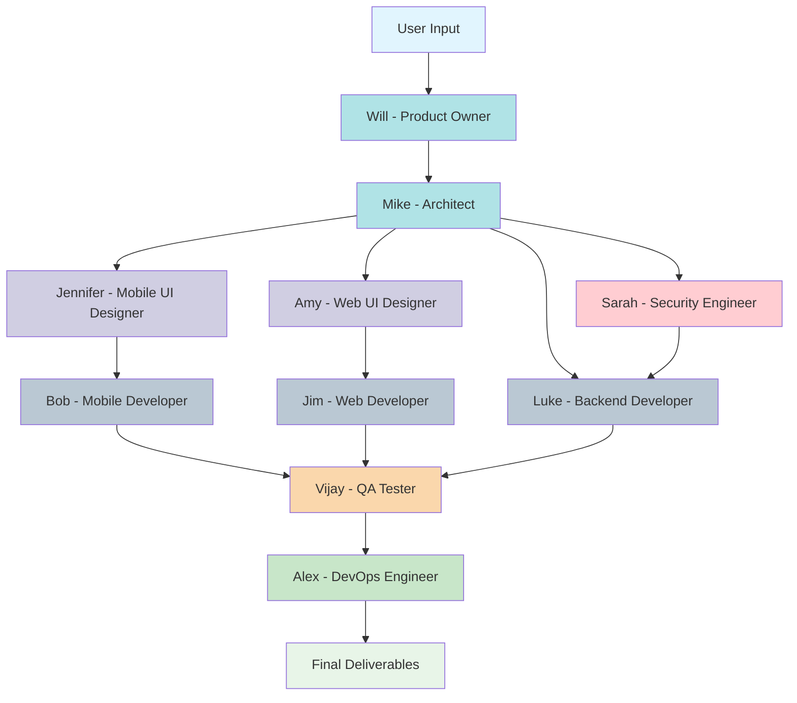

# AI Agent Team - Product Requirements Document

## Executive Summary
The AI Agent Team is a coordinated multi-agent system that automates the complete software development lifecycle from requirements gathering through production deployment. Each specialized agent performs specific roles in a defined workflow, producing structured deliverables that feed into subsequent development phases.

**Goal**: Create a comprehensive AI-powered development team that can take user requirements and produce fully documented, architected, tested, and production-deployed software solutions across mobile, web, and backend platforms.

## Project Overview
Build an intelligent agent orchestration system with 10 specialized sub-agents that collaborate to deliver complete software projects. The system follows a waterfall-inspired workflow where each agent's output becomes input for downstream agents.

**Reference Architecture**: `AI-Agent-Team.drawio.svg` provides the visual blueprint for agent relationships and data flow.

## Agent Workflow


## Agent Definitions
All agent definitions will be stored in `.claude/agents/` directory, following the pattern established by existing `code-reviewer.md`, `data-scientist.md`, and `debugger.md` templates.

### Core Agent Files
- `po.md`: Product Owner agent definition
- `architect.md`: System Architect agent definition  
- `mobile-ui-designer.md`: Mobile UI Designer agent definition
- `web-ui-designer.md`: Web UI Designer agent definition
- `mobile-developer.md`: Mobile Developer agent definition
- `web-developer.md`: Web Developer agent definition
- `backend-developer.md`: Backend Developer agent definition
- `security-engineer.md`: Security Engineer agent definition
- `qa-tester.md`: QA Tester agent definition
- `devops-engineer.md`: DevOps Engineer agent definition

## Agent Specifications

### Core Requirements
- **Agent Identity**: Each agent must identify themselves with name and role before starting work
- **Template Compliance**: Follow existing patterns from `.claude/agents/` reference files
- **Output Format**: All deliverables in structured Markdown format
- **Dependency Management**: Agents must validate input dependencies before execution

### 1. Will - Product Owner Agent
**Role**: Requirements gathering and product definition expert
- **Inputs**: Interactive user sessions
- **Outputs**: `docs/PRD.md` - Comprehensive product requirements document
- **Capabilities**: 
  - Interactive requirement elicitation
  - Stakeholder need analysis
  - Feature prioritization
  - Acceptance criteria definition

### 2. Mike - System Architect Agent  
**Role**: Technical architecture and system design expert
- **Inputs**: `docs/PRD.md`
- **Outputs**: `docs/DESIGN.md` - System architecture and technical design
- **Tech Stack**: Platform-agnostic architectural patterns
- **Capabilities**:
  - System architecture design
  - Technology stack recommendations  
  - API design and data modeling
  - Security and scalability planning

### 3. Jennifer - Mobile UI Designer Agent
**Role**: Mobile user interface and experience design expert
- **Inputs**: `docs/DESIGN.md`, `docs/PRD.md`
- **Outputs**: `docs/MOBILE-UI.md` - Mobile UI specifications and mockups
- **Capabilities**:
  - Mobile-first design principles
  - User journey mapping
  - Responsive design patterns
  - Accessibility compliance

### 4. Amy - Web UI Designer Agent
**Role**: Web user interface and experience design expert  
- **Inputs**: `docs/DESIGN.md`, `docs/PRD.md`
- **Outputs**: `docs/WEB-UI.md` - Web UI specifications and mockups
- **Capabilities**:
  - Modern web design patterns
  - Cross-browser compatibility
  - Performance-optimized layouts
  - Design system creation

### 5. Bob - Mobile Developer Agent
**Role**: Mobile application development expert
- **Tech Stack**: Flutter, Dart
- **Inputs**: `docs/MOBILE-UI.md`, `docs/DESIGN.md`, `docs/PRD.md`
- **Outputs**: `docs/MOBILE-DEV.md` - Mobile development implementation plan
- **Capabilities**:
  - Cross-platform mobile development
  - State management implementation
  - Native platform integration
  - Performance optimization

### 6. Jim - Web Developer Agent
**Role**: Web application development expert
- **Tech Stack**: Next.js, React, shadcn/ui, Tailwind CSS, TypeScript
- **Inputs**: `docs/WEB-UI.md`, `docs/DESIGN.md`, `docs/PRD.md`  
- **Outputs**: `docs/WEB-DEV.md` - Web development implementation plan
- **Capabilities**:
  - Modern React development
  - Server-side rendering
  - Component library integration
  - SEO optimization

### 7. Luke - Backend Developer Agent
**Role**: Server-side development and API expert
- **Tech Stack**: Python, FastAPI, SQLite (POC), PostgreSQL (Production), Redis
- **Inputs**: `docs/DESIGN.md`, `docs/PRD.md`, `docs/SECURITY.md`
- **Outputs**: `docs/BACKEND-DEV.md` - Backend implementation plan
- **Capabilities**:
  - RESTful API development
  - Database design and optimization (SQLite/PostgreSQL)
  - Authentication and authorization
  - Microservices architecture
  - Security implementation

### 8. Sarah - Security Engineer Agent
**Role**: Application and infrastructure security expert
- **Tech Stack**: Security frameworks, penetration testing tools, compliance standards
- **Inputs**: `docs/DESIGN.md`, `docs/PRD.md`
- **Outputs**: `docs/SECURITY.md` - Security architecture and implementation plan
- **Capabilities**:
  - Security architecture design
  - Threat modeling and risk assessment
  - Security code review guidelines
  - Compliance requirements (GDPR, SOX, HIPAA)
  - Penetration testing strategies
  - Security monitoring and alerting

### 9. Vijay - QA Tester Agent
**Role**: Quality assurance and testing expert
- **Inputs**: `docs/MOBILE-DEV.md`, `docs/WEB-DEV.md`, `docs/BACKEND-DEV.md`, `docs/SECURITY.md`, `docs/PRD.md`
- **Outputs**: `docs/QA-TEST.md` - Comprehensive testing strategy
- **Capabilities**:
  - Test case generation
  - Automated testing strategies
  - Performance testing plans
  - Security testing validation
  - Integration testing coordination

### 10. Alex - DevOps Engineer Agent
**Role**: Infrastructure, deployment, and operations expert
- **Tech Stack**: Docker, Kubernetes, AWS/GCP/Azure, CI/CD pipelines, Terraform, Monitoring tools
- **Inputs**: `docs/MOBILE-DEV.md`, `docs/WEB-DEV.md`, `docs/BACKEND-DEV.md`, `docs/QA-TEST.md`, `docs/SECURITY.md`
- **Outputs**: `docs/DEVOPS.md` - Infrastructure and deployment strategy
- **Capabilities**:
  - CI/CD pipeline design and implementation
  - Container orchestration and management
  - Cloud infrastructure provisioning
  - Monitoring, logging, and alerting setup
  - Database migration strategies (SQLite to PostgreSQL)
  - Production deployment and scaling
  - Disaster recovery planning

## Implementation Requirements

### Output Structure
```
docs/
├── PRD.md              # Product requirements (Will - Product Owner)
├── DESIGN.md           # Architecture design (Mike - Architect)  
├── MOBILE-UI.md        # Mobile UI specs (Jennifer - Mobile UI Designer)
├── WEB-UI.md           # Web UI specs (Amy - Web UI Designer)
├── MOBILE-DEV.md       # Mobile dev plan (Bob - Mobile Developer)
├── WEB-DEV.md          # Web dev plan (Jim - Web Developer)
├── BACKEND-DEV.md      # Backend dev plan (Luke - Backend Developer)
├── SECURITY.md         # Security architecture (Sarah - Security Engineer)
├── QA-TEST.md          # Testing strategy (Vijay - QA Tester)
└── DEVOPS.md           # Infrastructure & deployment (Alex - DevOps Engineer)

.claude/agents/
├── po.md               # Will - Product Owner agent definition
├── architect.md        # Mike - System Architect agent definition
├── mobile-ui-designer.md   # Jennifer - Mobile UI Designer
├── web-ui-designer.md      # Amy - Web UI Designer
├── mobile-developer.md     # Bob - Mobile Developer
├── web-developer.md        # Jim - Web Developer
├── backend-developer.md    # Luke - Backend Developer
├── security-engineer.md    # Sarah - Security Engineer
├── qa-tester.md           # Vijay - QA Tester
└── devops-engineer.md     # Alex - DevOps Engineer
```

### Quality Standards
- **Validation**: Each agent must validate input dependencies exist before execution
- **Error Handling**: Graceful failure modes when dependencies are missing
- **Consistency**: Uniform output format across all generated artifacts
- **Traceability**: Clear references between dependent artifacts

### Success Criteria
- [ ] All 10 agent definition files created in `.claude/agents/`
- [ ] Agent workflow successfully processes user input through all stages
- [ ] Generated artifacts are properly structured and cross-referenced
- [ ] Database strategy implemented (SQLite for POC, PostgreSQL for production)
- [ ] Security architecture integrated throughout development lifecycle
- [ ] CI/CD pipeline and deployment strategy defined
- [ ] Project documentation (`README.md`, `CLAUDE.md`) complete
- [ ] Repository is GitHub-ready with proper structure
- [ ] End-to-end testing validates complete workflow

### Performance Requirements
- **Response Time**: Each agent should complete tasks within 5 minutes
- **Reliability**: 95% success rate for complete workflow execution
- **Scalability**: Support concurrent execution of parallel agents (UI designers, developers)

### Security Considerations
- **Input Validation**: Sanitize all user inputs in Product Owner agent
- **Output Sanitization**: Ensure generated code follows security best practices
- **Access Control**: Restrict agent file system access to designated directories

### Documentation Deliverables
- **README.md**: Getting started guide with usage examples
- **CLAUDE.md**: Agent configuration and customization guide  
- **Architecture Documentation**: Complete system overview and integration patterns
